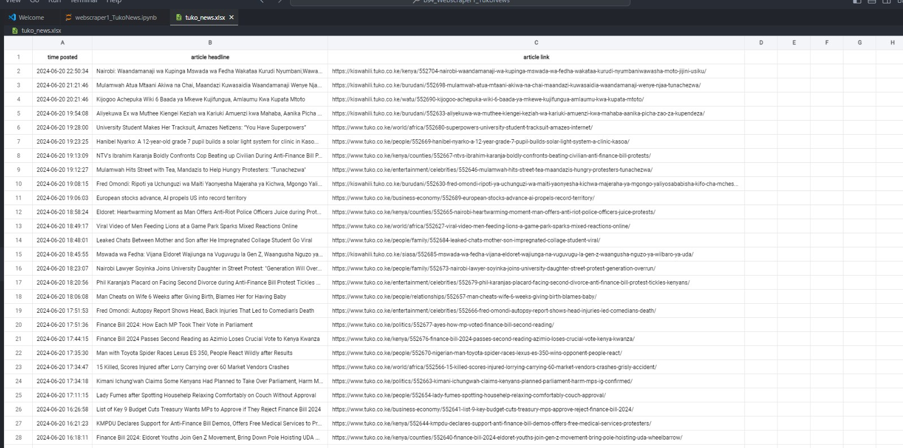

# Tuko News Website Scraper for Latest News

This Python script scrapes news articles from the Tuko.co.ke website and saves them to an Excel file.

- - The result should be a file like this:
    

## Features

- Fetches news articles from Tuko.co.ke
- Extracts headline, posting time, and article link
- Saves data to an Excel file, sorted by posting time

## Requirements

- Python 3.x
- Required libraries: requests, beautifulsoup4, pandas

## Usage

1. Install the required libraries: pip install requests beautifulsoup4 pandas
2. Run the script: python tuko_scraper.py
   - - or simply upload the "bs4_to_excel_Webscraper2_TukoNews.ipynb" file to jupyter NoteBooks and click Run All
3. The script will create an Excel file named `tuko_news.xlsx` with the scraped data.

## Note

- The "saveToGoogle*SpreedSheetVersion.ipynb" can only be run on Google Colad portal online. It will help if we intend to save the results in a \_Google Spreadsheets file (online)*
- This script is for educational purposes only. Please respect the website's terms of service when scraping.

# Contacts:

Incase you wish to reach out to me for any consultation, please contact Me at [https://wa.me/+254742125032](https://wa.me/+254742125032) , or email [mulu.bytes@gmail.com](mailto:mulu.bytes@gmail.com) .

## My website:

https://augastine-s-portfolio.vercel.app/
